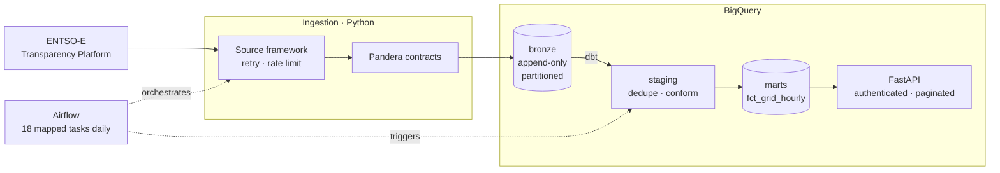
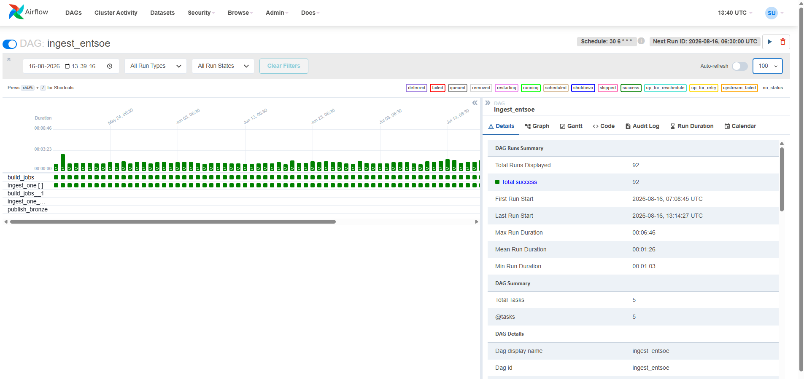
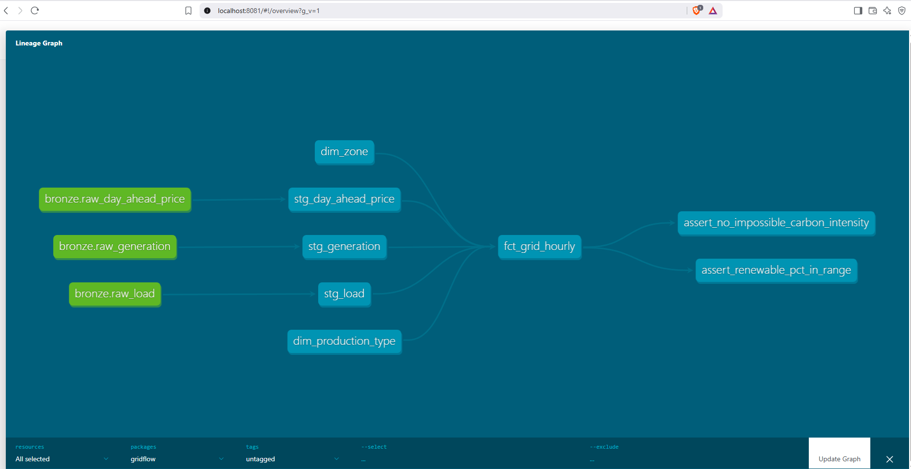
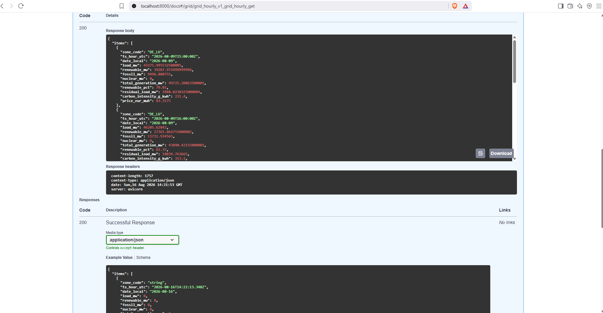

# entsoe-data-platform


Electricity load, generation mix, and day-ahead prices for six European bidding
zones, ingested from the ENTSO-E Transparency Platform into a partitioned
BigQuery warehouse, modelled with dbt and orchestrated in Airflow.



**Status:** in development. Ingestion, warehouse modelling, orchestration and a
read-only API are working end to end. Observability is next.

## Stack

Python 3.11 · BigQuery · dbt · Airflow 2.9 · Docker · Pandera · pytest · GitHub Actions

## What it does

- Pulls actual load, generation by production type, and day-ahead prices for
  DE_LU, AT, NL, FR, DK_1 and DK_2
- Validates every frame against a Pandera contract before it reaches the warehouse
- Writes to an append-only bronze layer, partitioned by month and clustered by zone
- Deduplicates revisions and conforms mixed source resolutions to hourly in dbt
- Models a fact table with renewable share, residual load and carbon intensity,
  gated by 14 automated data tests
- Runs daily in Airflow: ingestion fans out across 18 zone and source
  combinations, then publishes an Airflow Dataset that triggers the dbt build
  without either DAG referencing the other
- Serves the marts through a FastAPI layer with API key auth, cursor pagination
  and auto-generated OpenAPI docs

Current coverage: 13,096 hourly rows across 91 days and 6 zones.

## Orchestration



Ingestion expands into one task instance per zone and source. Failures are
isolated per task, so an unavailable feed does not block the rest of the run.
A three month backfill completed 1,799 task instances with no failures.

## Warehouse lineage



## API



Read-only endpoints over the marts, authenticated by API key, with cursor
pagination and a per-query byte ceiling so a malformed request cannot run up cost.

## Design notes

**Resolution varies by zone and by data type.** DK_1 publishes load hourly but
generation and day-ahead prices at 15 minutes; DE_LU publishes all three at 15
minutes. Day-ahead prices for DE_LU and AT are not available hourly at all, so a
request at the default resolution returns no data rather than an error worth
retrying. Every bronze row therefore carries its own `resolution_minutes` rather
than relying on a per-zone lookup, and conforming to a common hourly grain happens
in the staging layer.

**Market days are not always 24 hours.** A trading day runs local midnight to
local midnight in Europe/Berlin, which is 23 hours on the spring clock change and
25 on the autumn one. The window is also returned in UTC, because Python performs
naive arithmetic when subtracting two datetimes that share a `tzinfo` object, so
the offset change is silently ignored otherwise. That bug was caught by a test
written before the implementation.

**Bronze is append-only.** ENTSO-E revises published values for days after
publication, so a re-run writes a new version with a fresh `ingested_at` rather
than overwriting. Staging resolves this with `row_number()` over the natural key,
keeping the latest revision. Replays and backfills are therefore safe at any time.

**Partition filters are required.** BigQuery bills on bytes scanned, so bronze
tables set `require_partition_filter` and a query without a date predicate is
rejected rather than run expensively. Making expensive queries impossible is
more reliable than documenting that they are discouraged.

**Generation and consumption are separate flows.** ENTSO-E reports both for every
production type. Pumped storage consumption peaks around 6 GW in DE_LU, which is
electricity leaving the grid to fill reservoirs. Adding it to generation would
double count energy already counted when it was first produced, so the seed
carries a `flow_direction` and the fact table filters on it.

**Airflow parallelism has to match the host.** With Docker's default WSL2 memory
allocation the scheduler could not spawn workers fast enough, and Airflow marked
queued tasks failed before they ever started, with no start timestamp. Raising
the WSL memory limit and setting `max_active_tasks_per_dag` to 8 took a run from
twelve minutes with mostly failures to 42 seconds with none.

## Local setup

```bash
git clone https://github.com/suhasnu/entsoe-data-platform.git
cd entsoe-data-platform
py -3.11 -m venv .venv && .venv\Scripts\Activate.ps1
pip install -e ".[dev]"
cp .env.example .env        # fill in ENTSOE_API_KEY and GCP_PROJECT_ID
python -m gridflow.storage.migrate
docker compose up -d        # Airflow at localhost:8080
pytest
```

Requires an ENTSO-E API key (request from transparency@entsoe.eu) and a Google
Cloud service account with BigQuery Data Editor and Job User roles.

Docker needs at least 6 GB of memory. On Windows with the WSL2 backend this is
set in `~/.wslconfig`, not in Docker Desktop's settings panel.

## Known gaps

- Rows failing validation raise rather than being quarantined with a reason
- Marts rebuild in full rather than incrementally, which will not scale past a
  few million rows
- dbt in CI validates that models compile, not a full build against a test warehouse
- No alerting on pipeline failure

## Data licensing

Electricity data © ENTSO-E Transparency Platform, used under its terms of use.
No personal data is processed.